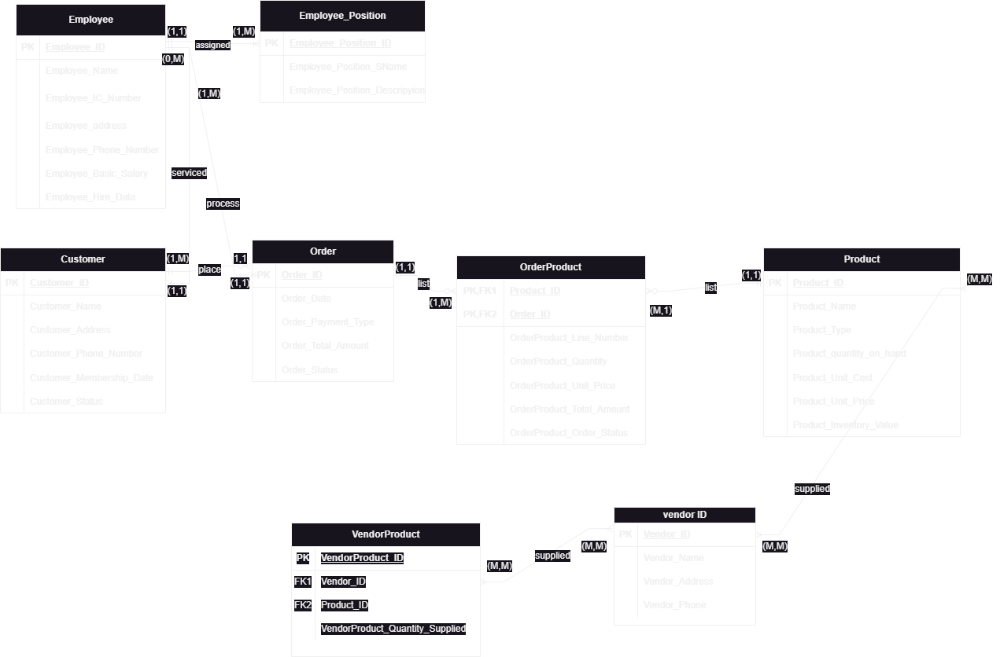

# CMT221 - Database Design (Project Design Phase)

This repository contains the Database Schema Design, Entity-Relationship Diagram (ERD), and Project Proposal documentation for **CMT221: Database Design - Group Project (Phase 1)** (Semester 1, Academic Session 2024/2025) at Universiti Sains Malaysia (USM).

## Course Details
- **Course Code:** CMT221
- **Course Name:** Database Design
- **Semester:** Semester 1, Year 2 (2024/2025)
- **Project Title:** GreenPublic Database System Design (Phase 1)

---

## Project Design Overview

The objective of Phase 1 is to design a relational database system based on real-world business specifications (a public green initiatives database tracking users, programs, recycling, and carbon metrics):
1. **Requirements Ideation & Business Rules:** Defining relationships and entity dependencies.
2. **Entity-Relationship Model (ERD):**
   - Entities, attributes, primary keys, and foreign keys.
   - Relationships (one-to-many, many-to-many) with proper cardinality and participation constraints.
   - Created visually using draw.io: [`ERDdrawio.drawio`](ERDdrawio.drawio) (with image version [`digram2.png`](digram2.png)).
3. **Database Schema Normalization:** Normalizing relations to 3NF (Third Normal Form) to eliminate redundancies.

---

## What I Did
- Formulated business rules and mapped them to entity attributes.
- Created the Entity-Relationship Diagram in [`ERDdrawio.drawio`](ERDdrawio.drawio) and exported the schema structure XML.
- Co-wrote the Project Proposal: [`GROUP42_CMT221_Proposal.pdf`](GROUP42_CMT221_Proposal.pdf).
- Co-wrote the Phase 1 Design Report detailing normalized tables, business constraints, and data dictionaries: [`Group42_CMT221_Report1.pdf`](Group42_CMT221_Report1.pdf).
- Referenced the original project guidelines: [`CMT221  ProjectGuidelines (updated).pdf`](CMT221%20%20ProjectGuidelines%20(updated).pdf).

---

## Tools & Design Utilities
- **Diagramming Tool:** Draw.io (XML-based `.drawio` vectors)
- **Document Management:** Microsoft Word / Adobe PDF formats
- **Database Modeling:** Crow's Foot Notation for relational schemas

---

## 📸 ERD Diagram

The Entity-Relationship Diagram (Crow's Foot Notation) for the GreenPublic system:

---

## Database Schema Summary

The normalized schema consists of the following core entities:

| Entity            | Primary Key           | Key Attributes                                             |
|-------------------|-----------------------|------------------------------------------------------------|
| Employee          | Employee_ID           | Name, IC_Number, Address, Phone, Basic_Salary, Hire_Date   |
| Employee_Position | Employee_Position_ID  | SName, Description                                         |
| Customer          | Customer_ID           | Name, Address, Phone, Membership_Date, Status              |
| Order             | Order_ID              | Date, Payment_Type, Total_Amount, Status                   |
| OrderProduct      | Product_ID + Order_ID | Line_Number, Quantity, Unit_Price, Total_Amount, Status     |
| Product           | Product_ID            | Name, Type, Qty_On_Hand, Unit_Cost, Unit_Price, Inventory  |
| VendorProduct     | VendorProduct_ID      | Vendor_ID (FK), Product_ID (FK), Quantity_Supplied         |
| Vendor            | Vendor_ID             | Name, Address, Phone                                        |

**Key Relationships:**
- `Employee` (1,1) ↔ (1,M) `Employee_Position` — each employee is assigned one position
- `Customer` (1,1) ↔ (1,M) `Order` — each customer places many orders
- `Order` (1,1) ↔ (1,M) `OrderProduct` — each order lists many products
- `Product` (M,M) ↔ `Vendor` via `VendorProduct` — products supplied by multiple vendors
